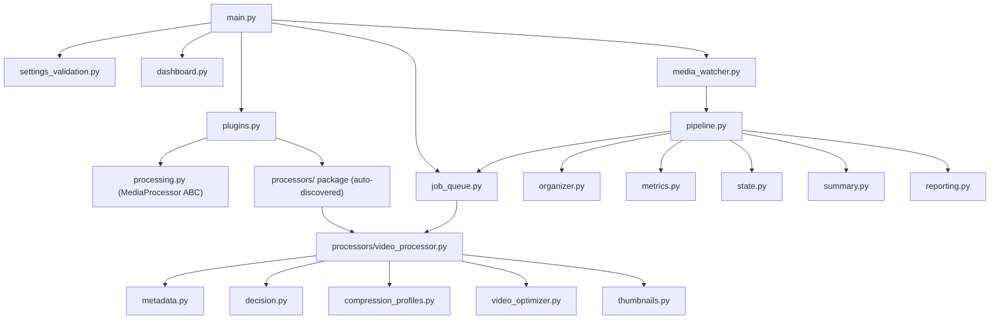

# Media Guardian (V2)

An extensible media automation platform. Drop a file into `incoming_media/`;
Media Guardian hands it to whichever auto-discovered **processor** claims it
(video today — images, audio, gifs, PDFs, etc. can be added later with zero
changes elsewhere), which probes it, decides — via a small rule engine, not
a hardcoded size check — whether acting on it is worthwhile, and if so
compresses it, generates a thumbnail, and files the result into an organized
folder structure. The original is never modified or deleted.

V2 adds a plugin-based processor abstraction, a bounded job queue/worker
pool, thumbnail generation, automatic folder organization, startup settings
validation, a health dashboard, and persisted performance metrics on top of
V1's hardened watcher + ffprobe analysis + rule-based decision engine +
ffmpeg — while every one of V1's behaviors keeps working exactly as before.

## 1. Install dependencies

From this folder (`MediaGuardian/`):

```bash
pip install -r requirements.txt
```

## 2. Install ffmpeg (includes ffprobe)

Media Guardian shells out to `ffmpeg` and `ffprobe`, so both must be on your
`PATH`.

**Windows:**
- Easiest: `winget install Gyan.FFmpeg` (or `choco install ffmpeg` if you use Chocolatey)
- Manual: download a build from https://www.gyan.dev/ffmpeg/builds/, unzip it,
  and add its `bin/` folder to your `PATH` environment variable
- Verify with: `ffmpeg -version` and `ffprobe -version` in a new terminal

If ffmpeg/ffprobe aren't found, Media Guardian logs a clear error and exits
immediately at startup rather than failing partway through a job.

## 3. Run

```bash
python main.py
```

At startup Media Guardian: validates every `config.py` setting (exits with a
readable error list if anything is wrong), discovers processor plugins,
starts the job queue's worker pool, prints a health dashboard, then starts
watching `incoming_media/` until you stop it with `Ctrl+C`. Logs go to both
the console and a rotating file (`media_guardian.log`).

## 4. Architecture



`media_watcher.py` only knows about filesystem events (ignore-filtering,
"has this file finished copying yet" stability polling, dedup-guarding
concurrent events for the same path). It has **zero knowledge of video** —
it hands every candidate file to `pipeline.Pipeline.process_new_file()`,
which:

1. Checks the persistent ledger (`state.py`) — never process the same file twice.
2. Asks each auto-discovered processor `supports(path)` until one says yes.
3. Calls `processor.extract_metadata()` / `.analyze()` to get a generic
   `ProcessingDecision` (`should_process`, `reasons`, `extra`).
4. Prints the detection report (`reporting.py`, using
   `processor.describe_metadata()` for the processor-specific lines).
5. If warranted, submits a `Job` to the shared `JobQueue` (bounded worker
   pool — never more than `WORKER_COUNT` ffmpeg processes at once).
6. When that job completes, `pipeline.handle_job_result()` runs the
   organizer, generates a thumbnail, records metrics, marks the ledger, and
   prints the completion report — all through the generic `ProcessingResult`
   shape, with no processor-specific code in `pipeline.py` itself.

## 5. The plugin system

Every concrete `MediaProcessor` subclass found in the `processors/` package
is auto-discovered and instantiated at startup (`plugins.py`). Today that's
just `VideoProcessor` (`processors/video_processor.py`), a thin adapter
around V1's unchanged `metadata.py` / `decision.py` /
`compression_profiles.py` / `video_optimizer.py`.

Adding a future `ImageProcessor`, `AudioProcessor`, `GifProcessor`, or
`PDFProcessor` means:
1. Create `processors/image_processor.py`.
2. Subclass `processing.MediaProcessor` and implement `supports`,
   `extract_metadata`, `analyze`, `process` (optionally
   `describe_metadata`/`generate_thumbnail`).

No edits to `plugins.py`, `pipeline.py`, `media_watcher.py`, or `main.py` —
it just starts working.

## 6. Job queue (bounded worker pool)

`job_queue.py` caps how many expensive `process()` calls (ffmpeg
invocations) can run at once, via `config.WORKER_COUNT` worker threads and a
`config.JOB_QUEUE_MAX_SIZE`-deep queue. Only the cheap
`supports`/`extract_metadata`/`analyze` steps run inline on the watcher's
per-file thread; the expensive part is always queued.

- **Backpressure:** `submit()` blocks (with a log warning) if the queue is
  full, rather than spawning unbounded ffmpeg processes.
- **Failure isolation:** a failing job is caught inside the worker loop —
  it's reported via the normal error-reporting path, but it can never kill
  a worker thread or stop the rest of the queue.
- **Graceful shutdown:** `Ctrl+C` stops the watcher and stops workers from
  picking up *new* queued jobs, but lets whatever's currently running
  finish. Anything still queued is abandoned and logged — since it was never
  marked in the ledger, it's automatically retried next run.

## 7. Thumbnails & folder organization

- **Thumbnails** (`thumbnails.py`): one JPEG/WebP frame per processed video,
  grabbed with `ffmpeg` at a configurable timestamp/width, written to
  `THUMBNAIL_OUTPUT_FOLDER`. Skipped if it already exists.
- **Organization** (`organizer.py`): after a **successful compression only**
  (skipped originals are left exactly where they were, in `incoming_media/`),
  the compressed file is moved (or copied) into
  `ORGANIZE_BASE_FOLDER/<category>`. The video processor categorizes
  **duration first** — `Videos/Shorts` if the clip is at/under
  `SHORTS_MAX_DURATION_SECONDS` — otherwise by output codec
  (`Videos/HEVC` / `Videos/H264`), falling back to `Videos/Long Videos`.

```
optimized_media/
├── Videos/
│   ├── Shorts/
│   ├── HEVC/
│   ├── H264/
│   └── Long Videos/
```

## 8. Health dashboard & performance metrics

Every startup prints a one-glance summary (`dashboard.py`): worker count,
active compression profile, watch/output folders, free disk space, ffmpeg
version, queue size, number of rules/processors loaded.

`metrics.py` tracks **lifetime** performance stats separately from the
per-run `summary.py` counters, persisted to `state/metrics.json` so they
survive restarts: files/hour, compression ratio, average encode time,
average bitrate reduction, and disk space saved today vs. lifetime. Both the
run summary and the lifetime metrics print when you stop Media Guardian.

## 9. Settings validation

`settings_validation.py` checks every relevant `config.py` value at startup
— unknown compression profile, non-positive worker/queue/threshold numbers,
invalid thumbnail format or organize mode, folders that can't be created —
and raises one readable, bulleted list of every problem found (not just the
first). On failure, Media Guardian logs the list and exits with code 1
before touching ffmpeg or the filesystem watcher at all.

## 10. Folder workflow

```
MediaGuardian/
├── incoming_media/     <- drop or save new videos here (.mp4, .mov, .mkv)
├── optimized_media/    <- compressed + organized copies land here
├── thumbnails/         <- generated preview images
└── state/              <- processed_files.json ledger + metrics.json (don't edit by hand)
```

1. Save/copy a video into `incoming_media/`.
2. Temp/partial files (names starting with `.`, `~`, `$`, or ending in
   `.tmp`, `.part`, `.partial`, `.crdownload`, `.download`) are ignored
   outright.
3. Media Guardian waits until the file's size stops changing.
4. The persistent ledger is checked — **a file is never processed twice**,
   even across restarts.
5. The first processor that `supports()` the file extracts metadata and
   prints a short report.
6. The rule engine (unchanged from V1, for video) decides compress-or-skip.
7. If compressing, the job is queued; once it completes, the compressed file
   is organized into a category subfolder, a thumbnail is generated, and
   metrics/ledger/summary are updated.
8. The original in `incoming_media/` is never touched.

## 11. Example output

```
--------------------------------------------------
Detected: IMG_0342.mp4

Codec: H264
Resolution: 3840x2160
FPS: 60
Duration: 4m32s
Bitrate: 48 Mbps
Size: 469 MB

Decision:
✓ Compress
Reason:
File exceeds size limit (469 MB > 250 MB) + Codec is H.264 + Bitrate exceeds maximum (48.0 Mbps >= 40.0 Mbps) + Resolution exceeds maximum (3840x2160 > 1920x1080)

Compression complete.

Original:
469 MB

New:
162 MB

Saved:
307 MB (65%)

--------------------------------------------------
```

On shutdown, both the per-run summary and the persisted lifetime metrics print:

```
Summary
--------------------------------------------------
Files processed: 4
Files skipped:   9
Space saved:     1.21 GB
Errors:          0
--------------------------------------------------

Performance Metrics (lifetime)
--------------------------------------------------
Files/hour:                6.0
Compression ratio:         28%
Average encode time:       42.3s
Average bitrate reduction: 71%
Disk saved today:          1.21 GB
Disk saved lifetime:       18.6 GB
--------------------------------------------------
```

## 12. The compression decision engine (unchanged from V1)

`decision.py` evaluates a list of small, independent `CompressionRule`
objects. Each rule looks only at the file's metadata/size and votes
`COMPRESS` or `SKIP`, with a human-readable reason. Any `COMPRESS` vote wins
outright; otherwise the file is skipped and every `SKIP` reason is reported.

| Rule | Vote | Condition |
|---|---|---|
| `SizeExceedsLimitRule` | Compress | size > `MAX_SIZE_MB` |
| `H264CodecRule` | Compress | codec is H.264 |
| `BitrateExceedsRule` | Compress | bitrate ≥ `MAX_VIDEO_BITRATE_MBPS` |
| `ResolutionExceedsRule` | Compress (+ downscale) | resolution > `MAX_RESOLUTION_WIDTH`x`MAX_RESOLUTION_HEIGHT` |
| `AlreadyHevcRule` | Skip | codec is HEVC |
| `BelowTargetBitrateRule` | Skip | bitrate ≤ `TARGET_BITRATE_MBPS` |
| `BelowSizeThresholdRule` | Skip | size ≤ `MAX_SIZE_MB` |

Adding a new rule is just a new `CompressionRule` subclass appended to
`decision.DEFAULT_RULES` — no existing rule or engine code changes.

## 13. Compression profiles (unchanged from V1)

`compression_profiles.py` defines named ffmpeg presets; `config.ACTIVE_PROFILE`
picks which one is used for every compression:

| Profile | Codec | CRF | Preset | Audio bitrate | Max resolution |
|---|---|---|---|---|---|
| `ARCHIVE` | libx265 | 18 | slow | 192k | none |
| `BALANCED` (default) | libx265 | 26 | medium | 128k | none |
| `SHARE` | libx264 | 28 | fast | 96k | 720p |
| `HIGH_QUALITY` | libx265 | 20 | slow | 192k | none |

## Configuration

Edit `config.py`:

| Setting | Default | Meaning |
|---|---|---|
| `WATCH_FOLDER` | `incoming_media/` | folder to watch |
| `OUTPUT_FOLDER` | `optimized_media/` | where compressed files are written before organization |
| `VIDEO_EXTENSIONS` | `.mp4, .mov, .mkv` | extensions the video processor claims |
| `STABLE_POLL_SECONDS` / `STABLE_REQUIRED_CYCLES` | `2.0` / `3` | how long/often to poll a file's size before treating a copy as finished |
| `LOG_FILE` | `media_guardian.log` | rotating log file path |
| `LOG_LEVEL` | `INFO` | logging verbosity |
| `LOG_MAX_BYTES` / `LOG_BACKUP_COUNT` | `5 MB` / `3` | log rotation size/retention |
| `IGNORED_NAME_PREFIXES` | `. ~ $` | filenames starting with these are ignored |
| `IGNORED_SUFFIXES` | `.tmp .part .partial .crdownload .download` | filenames ending with these are ignored |
| `STATE_DIR` / `PROCESSED_LEDGER_FILE` | `state/processed_files.json` | persistent "already handled" ledger |
| `FFMPEG_TIMEOUT_SECONDS` | `3600` | kill a hung/crashed ffmpeg after this many seconds |
| `MAX_SIZE_MB` | `250` | size threshold used by the size-related rules |
| `HEVC_CODEC_NAMES` / `H264_CODEC_NAMES` | `{hevc, h265}` / `{h264, avc1}` | codec name sets used by codec-related rules |
| `MAX_VIDEO_BITRATE_MBPS` | `40.0` | bitrate at/above this triggers compression |
| `MAX_RESOLUTION_WIDTH` / `MAX_RESOLUTION_HEIGHT` | `1920` / `1080` | resolution above this triggers compression + downscale |
| `TARGET_BITRATE_MBPS` | `8.0` | bitrate at/below this is an "already efficient" signal |
| `ACTIVE_PROFILE` | `BALANCED` | which profile in `compression_profiles.py` to encode with |
| `PROCESSORS_PACKAGE` | `processors` | package auto-scanned for `MediaProcessor` plugins |
| `WORKER_COUNT` | `2` | concurrent ffmpeg jobs (job queue worker threads) |
| `JOB_QUEUE_MAX_SIZE` | `10` | jobs allowed to wait before `submit()` blocks |
| `THUMBNAIL_ENABLED` | `True` | generate a thumbnail after each successful compression |
| `THUMBNAIL_OUTPUT_FOLDER` | `thumbnails/` | where thumbnails are written |
| `THUMBNAIL_TIMESTAMP_SECONDS` | `5.0` | where in the video to grab the thumbnail frame |
| `THUMBNAIL_WIDTH` | `320` | thumbnail width in pixels (height auto-scaled) |
| `THUMBNAIL_FORMAT` | `jpg` | `jpg` or `webp` |
| `ORGANIZE_ENABLED` | `True` | move/copy compressed files into category subfolders |
| `ORGANIZE_MODE` | `move` | `move` or `copy` |
| `ORGANIZE_BASE_FOLDER` | `OUTPUT_FOLDER` | root folder the category subfolders are created under |
| `SHORTS_MAX_DURATION_SECONDS` | `60` | videos at/under this duration are categorized as Shorts |
| `METRICS_FILE` | `state/metrics.json` | persisted lifetime performance stats |
| `METRICS_RATE_WINDOW_SECONDS` | `3600` | window used to compute the files/hour rate |

## Error handling & reliability

- **ffmpeg/ffprobe missing:** checked once at startup; the program logs a
  clear message and exits instead of crashing later inside a worker thread.
- **Invalid config:** every setting is validated at startup with a
  human-readable, complete list of problems (`settings_validation.py`).
- **Invalid/corrupt video:** validated with `ffprobe` before compression; if
  it fails, the file is skipped and logged, original left untouched.
- **Interrupted/crashed ffmpeg:** ffmpeg writes to a `.partial` temp file
  first; on failure, crash, or timeout (`FFMPEG_TIMEOUT_SECONDS`) the partial
  file is deleted so `optimized_media/` never ends up with a corrupt
  half-encoded file, and the worker thread never hangs.
- **Never processed twice:** a persistent ledger (`state/processed_files.json`)
  keyed by path + size + modified-time means restarting Media Guardian never
  reprocesses (or recompresses) a file it already handled.
- **Bounded concurrency:** the job queue caps how many ffmpeg processes run
  at once (`WORKER_COUNT`), regardless of how many files land at once.
- **One bad file/job can't take down the process:** every per-file operation
  and every queued job is wrapped in exception handling that logs, counts
  the error, and moves on — nothing propagates up to kill a thread.
- **Graceful shutdown:** `Ctrl+C` stops the watcher, lets in-flight jobs
  finish, abandons (and logs) anything still queued for automatic retry next
  run, then flushes the run summary and lifetime metrics.
- **Duplicate filenames:** if a destination folder already has a file with
  that name, the new one is saved as `name_1.mp4`, `name_2.mp4`, etc.

## Logs & summary

Each processed file logs concise lines to `media_guardian.log` and prints a
detailed report to the console (metadata + decision + reasons + before/after
sizes). When stopped with `Ctrl+C`, both the in-memory run summary
(files processed/skipped/errored, space saved) and the persisted lifetime
performance metrics are printed.
